<div align="center">


# ⚡ Viralito

**El editor de videos virales con IA que corre 100% en TU computadora — en español, sin nube, sin API keys, sin mensualidades.**

## [⬇️ &nbsp;DESCARGAR LA APP PARA WINDOWS&nbsp; ⬇️](https://github.com/ponchovillalobos/viralito/releases/latest)

**[👉 Bajar la última versión desde Releases 👈](https://github.com/ponchovillalobos/viralito/releases/latest)**

*Windows 10/11 x64 · 8 GB RAM · ~6 GB libres en disco · no requiere instalar nada más*

</div>

### 🚀 Instalar en 2 pasos (con instalador)

1. **Baja** `EstrategiaViralStudio-Setup.exe` desde
   [**Releases → latest**](https://github.com/ponchovillalobos/viralito/releases/latest) (~0.2 MB).
2. **Doble clic** — el instalador revisa tu compu, descarga todo solo con barra
   de progreso, lo instala y te deja el **icono en el Escritorio**. La primera
   vez que abras la app baja el modelo de voz (~1.5 GB, una sola vez) y queda
   lista. No necesitas Node, Python ni ffmpeg: todo va adentro.

<details>
<summary>📦 Alternativa sin instalador (zip portable)</summary>

1. Baja el `.zip` (p. ej. `EstrategiaViralStudio-v0.3.1.zip`) desde Releases.
2. Descomprímelo en una carpeta fuera de OneDrive, p. ej. `C:\Viralito`.
3. Doble clic en `desktop.exe`.

</details>

> Subes un video hablado → la IA lo transcribe, lo corta, le pone subtítulos
> karaoke, efectos, música, gráficas animadas e ilustraciones según lo que dices,
> y te genera la descripción perfecta para cada red. Lo que Opus Clip y Submagic
> cobran $19-39 USD/mes — aquí es tuyo, local y de código abierto (MIT).

```text
┌──────────────────────────────────────────────────────────────────┐
│  ⚡ Viralito                                              ─ □ ✕  │
├──────────────────────────────────────────────────────────────────┤
│  📁 Suelta tu video aquí        │  🎨 Estilo: 👑 Premium        │
│  ─────────────────────────────  │  🔤 Fuente: Bangers · 🟡      │
│  mi-video-curso.mp4  (12:34)    │  🎵 Música: auto (ducking)    │
│                                 │  🧠 Director emocional: ON    │
│  ⏱️ Timeline                                                     │
│  ├─🔍zoom──📊gráfica──💥sfx──🖼️ilustración──🔍zoom──📈chart─┤   │
│                                                                  │
│  [ 👁️ Vista previa ]                 [ 🚀 GENERAR VIDEO VIRAL ] │
└──────────────────────────────────────────────────────────────────┘
```

💛 **¿Te sirve la app? [Apoyala con una donación](.github/FUNDING.yml)** — mantiene el desarrollo vivo.

---

## 📸 Así se ve

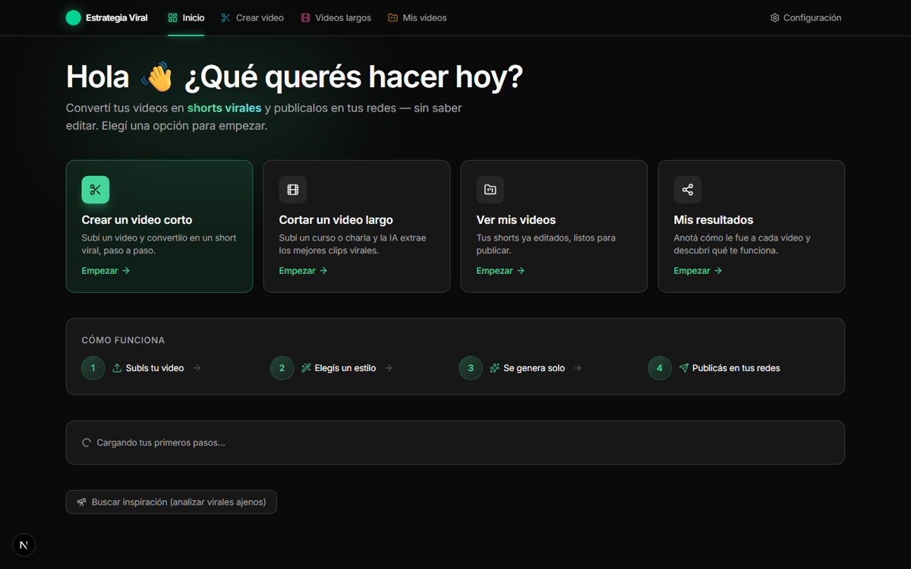

| Crear un video corto | De un video largo a clips |
|---|---|
| 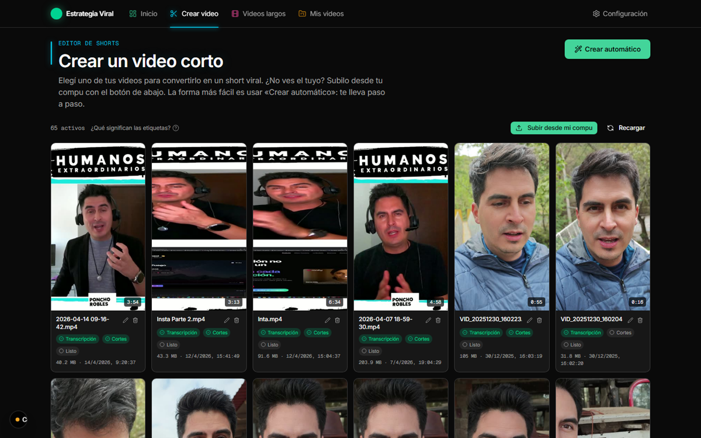 | 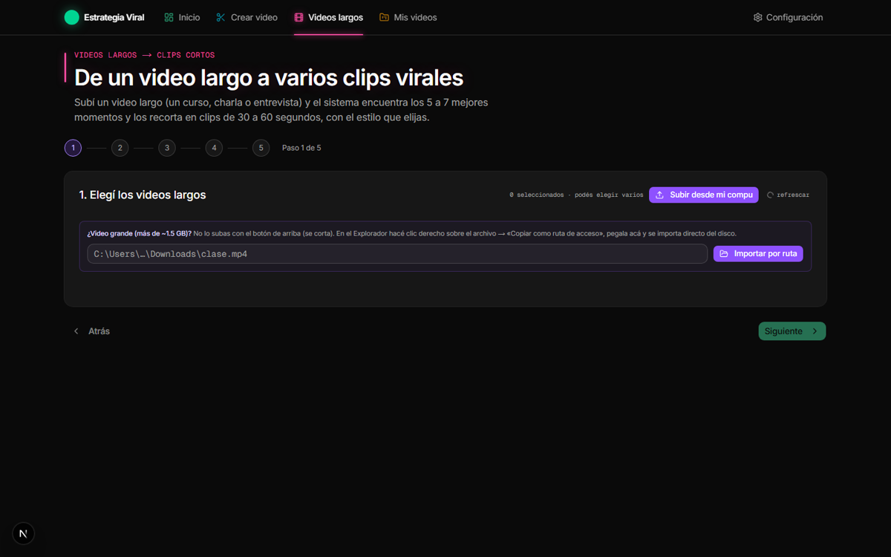 |

### 🎨 Lo que sale: el estilo Editorial y sus temas

| Prensa 1900 | Vogue noir | Zine riso | Clásico |
|---|---|---|---|
| 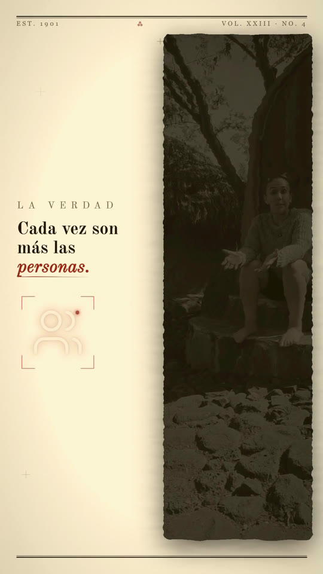 | 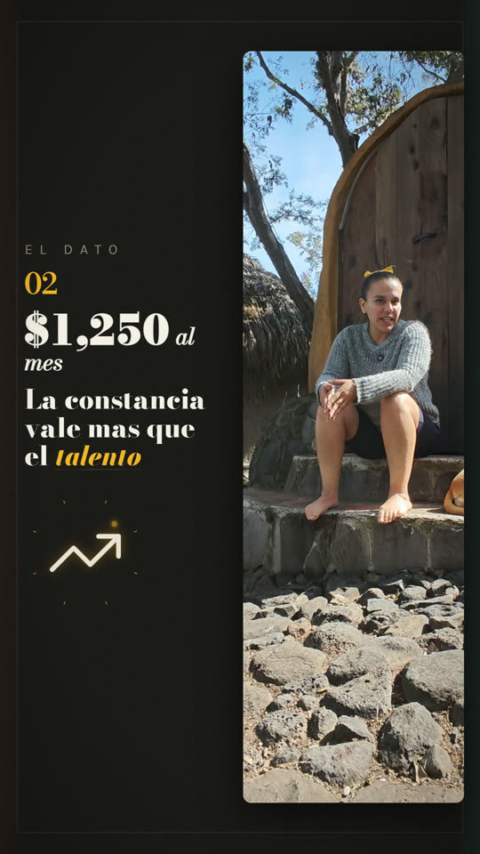 | 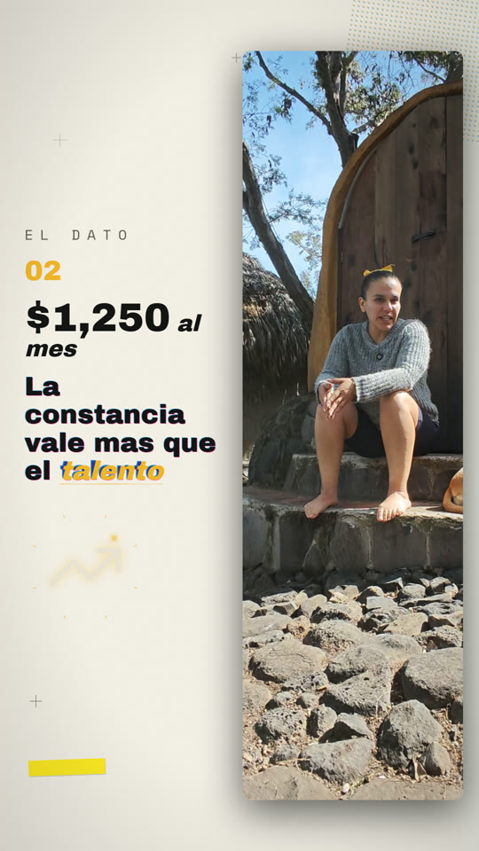 | 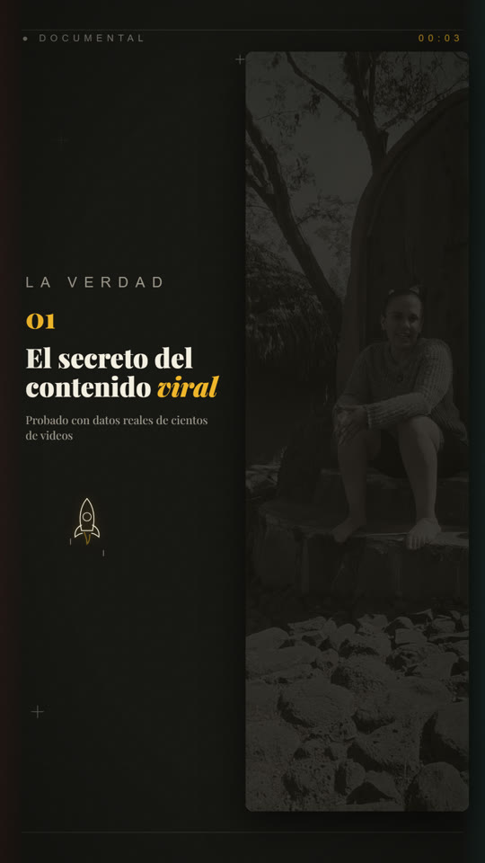 |

| Tinta a mano | Contador de datos | Collage IA | Globo terráqueo |
|---|---|---|---|
| 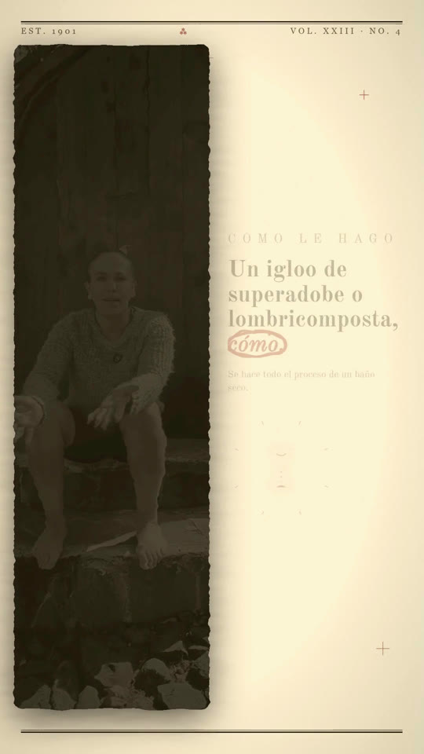 | 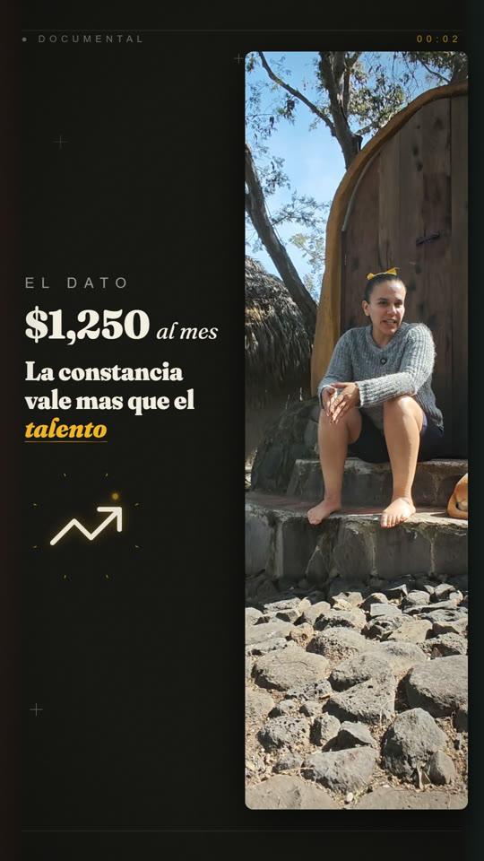 | 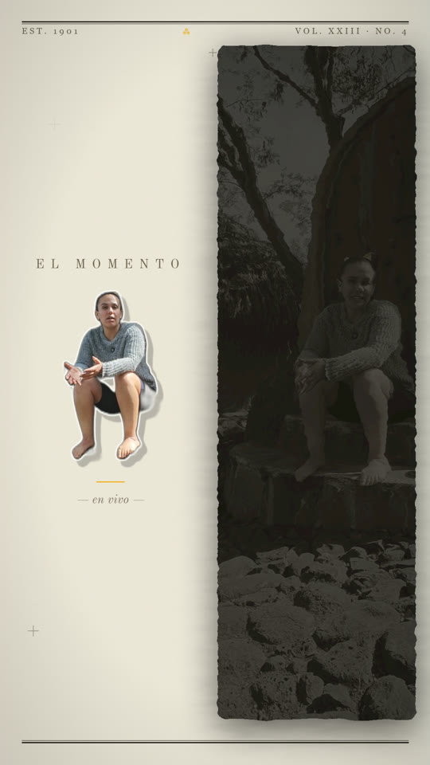 | 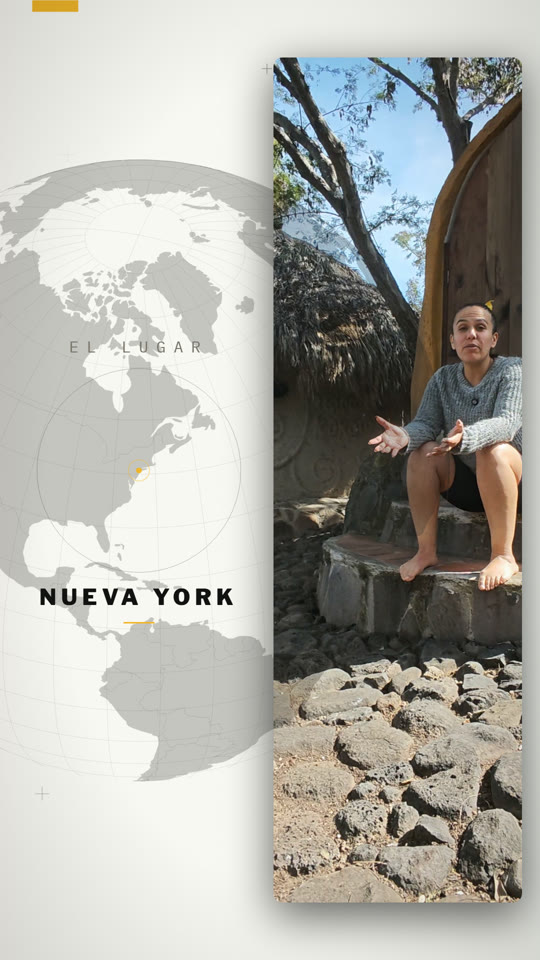 |

| Gráficas estilo Economist | Gráficas dibujadas a mano |
|---|---|
| 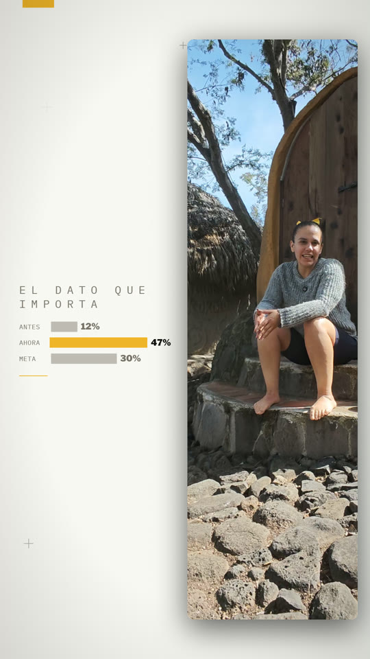 | 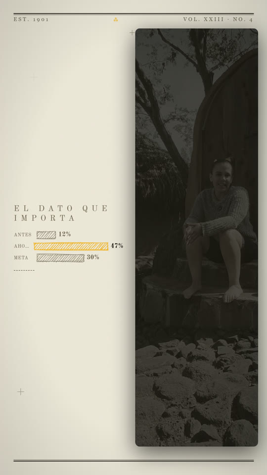 |

> Todas las imágenes son **renders reales** generados por la app — subrayados que se
> dibujan al ritmo de tu voz, recortes con IA local, globos que hacen zoom al lugar
> que mencionás, y 17 temas editoriales con identidad propia.

---

### ⚠️ Si Windows muestra "Windows protegió tu PC" (SmartScreen)

**Es normal y NO significa virus.** Windows muestra ese cartel azul con CUALQUIER
programa nuevo que todavía no descargó mucha gente — tenga o no firma digital de
pago. Es un tema de "reputación", no de seguridad: a medida que más personas
bajan Viralito, el aviso desaparece solo. Mientras tanto, para abrirlo:

1. Haz clic en **"Más información"** (el texto chiquito en el cartel azul).
2. Aparece el botón **"Ejecutar de todas formas"** — haz clic ahí.

Eso es todo. Lo haces una vez y listo.

**¿Quieres verificar que la descarga es la auténtica?** Cada release incluye un
`SHA256SUMS.txt` con la huella de cada archivo. Compárala en PowerShell:

```powershell
Get-FileHash EstrategiaViralStudio-Setup.exe -Algorithm SHA256
```

Si la huella coincide con la del `SHA256SUMS.txt`, el archivo está intacto y es
el oficial.

> 💡 **¿El navegador dice "no se descarga con frecuencia / podría ser peligroso"?**
> Es el mismo tema de reputación. En Chrome/Edge: flecha junto a la descarga →
> **"Conservar"** → **"Conservar de todos modos"**.

---

## ✨ Qué hace (todo automático, todo local)

- **Cortos virales** desde cualquier video hablado: transcripción palabra-por-palabra
  (WhisperX), silencios y **muletillas en español** fuera ("eh", "este…"), subtítulos
  karaoke con 11 tipografías y colores a elección.
- **Videos largos → clips**: subí un curso/charla de 90 min y la IA encuentra los
  momentos más virales (con score 0-100), los corta y los edita.
- **🧠 Director emocional** *(único en el mercado)*: analiza CÓMO hablás — la música
  baja cuando hablás y respira en tus pausas (auto-ducking), los zooms caen en tus
  picos emocionales, los efectos se intensifican con tu voz.
- **15 estilos de edición** con mini-demos animadas: del MrBeast intenso al
  **📰 Editorial documental** (panel lateral + titulares serif gigantes + ilustraciones
  line-art doradas, con 4 temas de fuente/fondo) y los **Motion** con fondos que
  laten al ritmo de la música.
- **Miles de ilustraciones animadas**: 609 del catálogo Noto de Google (dinero
  volando, relojes, cohetes…) + 1,500+ íconos Lucide animados como line-art +
  18 ilustraciones premium dibujadas a mano — elegidas solas según lo que decís.
- **Gráficas animadas de datos**: si decís "el 70% de las personas", aparece la
  gráfica. Contadores, barras, embudos, comparativas VS, estrellas — 9 tipos.
- **Copys por red con IA local**: descripción + hashtags adaptados a TikTok,
  Instagram y LinkedIn, listos para copiar y pegar.
- **Timeline visual + previews**: mirá dónde cae cada efecto, y generá una vista
  previa real (foto o 3s en movimiento) antes de renderizar.
- **App de escritorio** (Tauri): ventana nativa, portable — descargá, descomprimí y listo.

## 🎨 Los 15 estilos

| | Estilo | Qué hace |
|---|---|---|
| 🔥 | **Viral (Hype)** | Subtítulos grandes + tracking de cara + gráficas |
| ⚡ | **Viral intenso** | + jump cuts, reaction zooms, espejos |
| 🎵 | **Viral con sonidos** | + SFX coordinados con lo que decís |
| 👑 | **Premium (Supreme)** | Todo activado |
| 📰 | **Editorial** | Documental: panel + serif gigante + line-art (4 temas × 10 colores) |
| ✨🎧🌐 | **Motion Pro / Beat / Grid** | Animación pura sin emojis; el fondo late con la música |
| 📊📈 | **Gráficos & Motion / Max** | Charts + íconos de concepto al máximo |
| 🎞️🖼️ | **B-roll full / PIP** | Videos de archivo de Pexels (API key gratis opcional) |
| 🧍 | **Texto detrás** | La palabra clave queda detrás tuyo (IA de segmentación) |
| 🥊🤍 | **Impacto / Limpio** | Énfasis puntual / sobrio profesional |

## 🆓 Por qué gratis y local

Tus videos nunca salen de tu máquina. No hay límites de minutos, ni marcas de agua,
ni planes. Los modelos de IA (Whisper, MediaPipe, Ollama opcional) corren en tu CPU.
El único costo es tu electricidad.

## 🔄 Actualizaciones

La app **avisa sola** cuando hay una versión nueva: te muestra un aviso adentro
de la app con el link directo al instalador de
[Releases](https://github.com/ponchovillalobos/viralito/releases/latest)
— tus videos y ajustes no se tocan (viven fuera de la app).

## 🤝 Contribuir / Donar

- ⭐ Dale una estrella al repo — ayuda más de lo que piensas
- 🐛 Issues y PRs bienvenidos
- 💛 Donaciones: activa el botón Sponsor (ver `.github/FUNDING.yml`)

## 📄 Licencia

[MIT](./LICENSE) © 2026 Poncho Robles — úsalo, modifícalo, vende tus videos con él.
Los fondos animados están inspirados en [remotion-scenes](https://github.com/lifeprompt-team/remotion-scenes) (MIT), reescritos para este proyecto.

---

## 🛠️ Para desarrolladores (el código de la app)

> **Si solo quieres USAR la app, no necesitas nada de esto.**
> Baja el `.zip` de [Releases](https://github.com/ponchovillalobos/viralito/releases/latest) y listo (3 pasos, arriba).
> Lo de abajo es el código fuente con el que se CONSTRUYE la app
> (`frontend/` es el motor, `remotion/` el render, `python/` la IA, `desktop/` el launcher).

### Correr desde código

Requisitos: Windows 10/11 x64, Node 18+, Python 3.11, ~10 GB libres.

```bash
git clone https://github.com/ponchovillalobos/viralito
cd viralito

# 1. Python (pipeline de IA)
cd python && python -m venv venv && venv\Scripts\activate
pip install torch torchaudio --index-url https://download.pytorch.org/whl/cpu
pip install -r requirements.txt && cd ..

# 2. Frontend + motor de video
cd frontend && npm install && cd ../remotion && npm install && cd ..

# 3. ffmpeg: bajá el build "essentials" de gyan.dev y descomprimilo en
#    C:\viral-data\tools\  (o seteá VIRAL_FFMPEG_EXE)

# 4. Arrancar
cd frontend && npm run dev    # → http://localhost:3000
```

Los modelos de transcripción (~2 GB) se descargan solos la primera vez.
Guía completa: [`docs/USAGE.md`](./docs/USAGE.md) · Efectos: [`docs/EFFECTS.md`](./docs/EFFECTS.md)

### Construir la app de escritorio

```bash
cd frontend && npx next build          # server de producción
cd ../desktop && npm install && npx tauri build   # exe del launcher
powershell -File desktop/bundle.ps1    # arma payload/ autocontenido + SHA256
```

El paquete final es la carpeta `release\` (exe + `payload\` con node, python,
ffmpeg y todo adentro): se copia a cualquier Windows y funciona sin instalar
nada. Checklist completo para publicar una versión: [`docs/RELEASE.md`](./docs/RELEASE.md)
